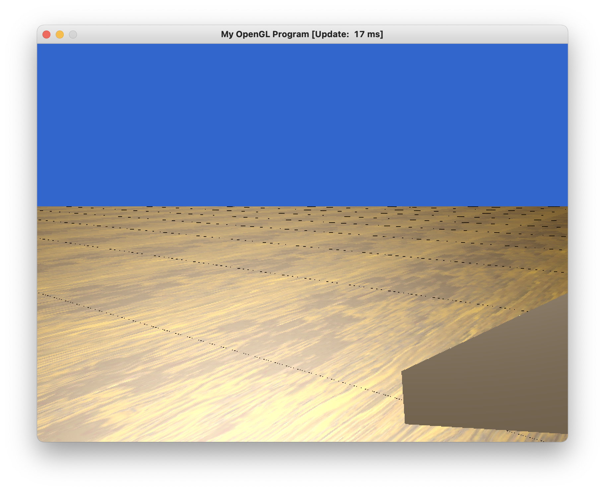

# BlockGame
A Minecraft-like POC game made in C++

# Files

```text
src/utils           OpenGL helper functions
src/Scene           combines helper functions and map data to display scene
src/generator/*     world generator
src/repr/*          representations of data (Chunk, World, Block), etc.
src/main            really messy right now should probably be separated into multiple files
```

# Installation

## MacOS
Install all dependencies listed in `dependencies.sh`. You can install with `./dependencies.sh`


# Progress Report

## Team
- Andrew Gazelka
- Quynh Do
- Allison Miller

## Description
We plan to build a minimalistic block game inspired by Minecraft. We use OpenGL and C++ (20).
The goals we plan to accompish are as follows

- [ ] Terrain generation
  - [x] Minimal flat terrain generation
  - [ ] Hills
  - [ ] Trees and other structures
  - [ ] Caves (if we get time)
- [x] Saving worlds
- [x] Loading worlds
- [x] Displaying blocks
- [x] Hand animation
- [ ] Simple Physics (jumping)
- [ ] Flying (activate and de-activate)
- [x] Collision
- [ ] Cross hair
- [ ] Block selection indicator
- [ ] Building
- [ ] Break blocks

## Progress Plan
The milestones are mostly listed in the description. However, it is important to list _when_
we want to get everything done. By May 1st our plan is to have everything look like this

- [ ] Terrain generation
  - [x] Minimal flat terrain generation
  - [x] Hills
  - [ ] Trees and other structures
  - [ ] Caves (if we get time)
- [x] Saving worlds
- [x] Loading worlds
- [x] Displaying blocks
- [x] Hand animation
- [x] Simple Physics (jumping)
- [x] Flying (activate and de-activate)
- [x] Collision
- [x] Cross hair
- [ ] Block selection indicator
- [ ] Building
- [x] Break blocks

### Concerns
One concern is that Andrew has a job interview around when this is due, so he will need to 
make sure to do work beforehand. Another concern is displaying 2D-related objects, such 
as a menu of blocks or the selection indicator over a block. This seems simple, but we 
still have to learn how to do it as most of the class we have learned 3D graphics.

### Progress
This is described in the description section

### Difficulties and Resolution
A big difficulty has been debugging. Andrew did a lot of work at once to setup this
project, and it took him a bit of time to figure out how to display simple blocks correctly. 
Although computer graphics usually has the z dimension pointing up and down, Minecraft 
has the y direction pointing up and down. Even though Andrew knew this, he was thinking
in Minecraft-world and had a bunch of code using y where it should have been z. A good
way to avoid this is to have frequent debugging.


## Image of Progress

### Hitting Animation


### Infinitely* generated world
Right now this is just flat, but it _does_ go on "forever."


* = not immune to overflowing longs.

