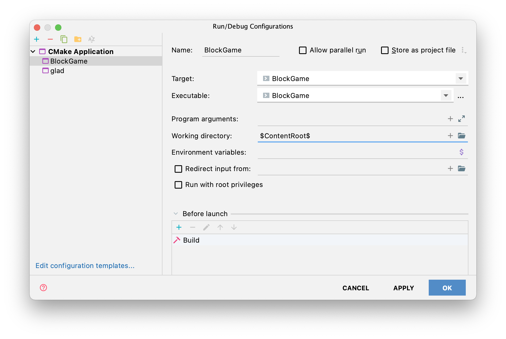

# BlockGame
A Minecraft-like POC game made in C++

# Files

```text
src/utils           OpenGL helper functions
src/Scene           combines helper functions and map data to display scene
src/generator/*     world generator
src/repr/*          representations of data (Chunk, World, Block), etc.
src/main            really messy right now should probably be separated into multiple files
```

# Installation

## MacOS

- Make sure to clone the repo recursively `git clone {url} --recursive`
  - If you have already cloned do `git submodule update --init`
- Install all dependencies listed in `dependencies.sh`. You can install with `./dependencies.sh`

# Running

- You must run from the project root directory. This can be done in CLion as seen below:




# Final Write-Up

## Team
- Andrew Gazelka
- Quynh Do
- Allison Miller

## Project Description & Overview

Our final project is a real-time minimalistic block game inspired by Minecraft. We use OpenGL and C++ (20).
The goals we aimed to accomplish and what we were able to achieve are as follows

- [ ] Terrain generation
  - [x] Minimal flat terrain generation
  - [x] Hills
  - [ ] Trees and other structures
  - [ ] Caves (if we get time)
- [x] Saving worlds
- [x] Loading worlds
- [x] Displaying blocks
- [x] Hand animation
- [x] Simple Physics (jumping)
- [x] Flying (activate and de-activate)
- [x] Collision
- [x] Cross hair
- [x] Block selection indicator
- [x] Building
- [x] Break blocks

### Main obstacles

The number of blocks we generated for the game is pretty large, so Andrew had to optimize the rendering so that the game is runnable. Quynh and Allison were also not very familiar with the code base that Andrew set up, so it took them a while to understand it well enough to implement the breaking and building blocks features. Converting between 2D and 3D perspective was another obstacle that we encountered since we mostly learned about 3D graphics in our class.

## Connection to our class

Our project is an extension of what we learned in Project 4, which involves real-time 3D game programming in OpenGL. Our game demonstrates the rendering pipeline. We have simple animation of an object hitting the blocks. Moreover, we use both perspective and orthographic projection in the game. The perspective projection is for rendering the 3D scene, and the orthographic projection is for rendering the cross-hair on the 2D screen. We implement a dynamic environment where the player can interact with the blocks by breaking or building a new one. User interface includes mouse and keyboard control, jumping, block selection indicator, and simple Imgui integration. Lighting and Shading are done using the provided shader codes from project 4.

## Key features and Images

### Terrain Generation
Terrain is generated using [Open Simplex Noise](https://github.com/SRombauts/SimplexNoise). Each chunk (16x16x256) area
is generated independently of other chunks. If a chunk has not been saved to disk, it is generated. If it has been 
generated and is in memory, it is loaded from memory. If it is on disk, it is loaded from disk.

### Optimizations
Only the top-most blocks of the world are rendered. This could be improved to only render polygons that can be shown
(we are still rendering the back of blocks), but we have not reached that point yet.

### Movement
Player can control camera rotation using mouse and camera movement using keyboard.

Keys map:

- A/D - move left/right
- W/S - move forward/backward
- G - enable/disable gravity (toggle flying mode)
- Space - Jump (not flying mode) / Move up (flying mode)
- Left shift - Move down (flying mode)

#### Jumping


#### Flying


### Breaking blocks
- Press and hold the mouse to break the blocks. The player can break the blocks near them.


### Building blocks
- Move the cross hair to the targeted position and press P to place a block.


## Future work

Since this is a 3D game, there are many rooms to improve in the future. We could complete the terrain generation process to include trees, caves, and other structures. We should optimize our terrain enough so that we could add block textures for better visualization. We can also introduce a wider range of block types to display different materials. User interaction could also be improved to be smoother and more accurate.
